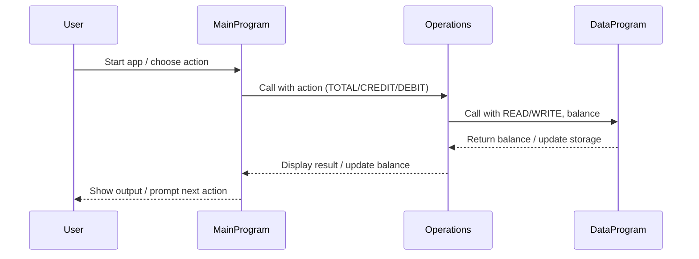

# COBOL Student Account Management System Documentation

## Purpose
This project demonstrates a simple student account management system using COBOL. It allows users to view their account balance, credit (add funds), and debit (withdraw funds) with basic business rules enforced.

### File Overview

- **main.cob**
  - Entry point for the application.
  - Handles user interaction and menu display.
  - Accepts user choices and calls the Operations module for account actions.

- **operations.cob**
  - Implements the logic for account operations: viewing balance, crediting, and debiting.
  - Calls DataProgram to read/write the balance.
  - Enforces business rules, such as checking for sufficient funds before debiting.

- **data.cob**
  - Manages persistent storage of the account balance.
  - Provides read and write operations for the balance value.

## Key Functions

- **main.cob**
  - Displays the menu and prompts the user for input.
  - Calls Operations with the selected action (view, credit, debit, exit).

- **operations.cob**
  - Handles each operation type:
    - `TOTAL`: Reads and displays the current balance.
    - `CREDIT`: Accepts an amount, adds it to the balance, and updates storage.
    - `DEBIT`: Accepts an amount, checks for sufficient funds, subtracts from balance if possible, and updates storage.
  - Calls DataProgram for reading and writing balance.

- **data.cob**
  - `READ`: Returns the current stored balance.
  - `WRITE`: Updates the stored balance with a new value.

## Business Rules (Student Accounts)

- The account starts with an initial balance of 1000.00.
- Debit operations are only allowed if the account has sufficient funds.
- All credit and debit operations update the persistent balance.
- Invalid menu choices prompt the user to select again.

---

## Sequence Diagram: Data Flow

---

For further details, review the COBOL source files in the `src/cobol/` directory.